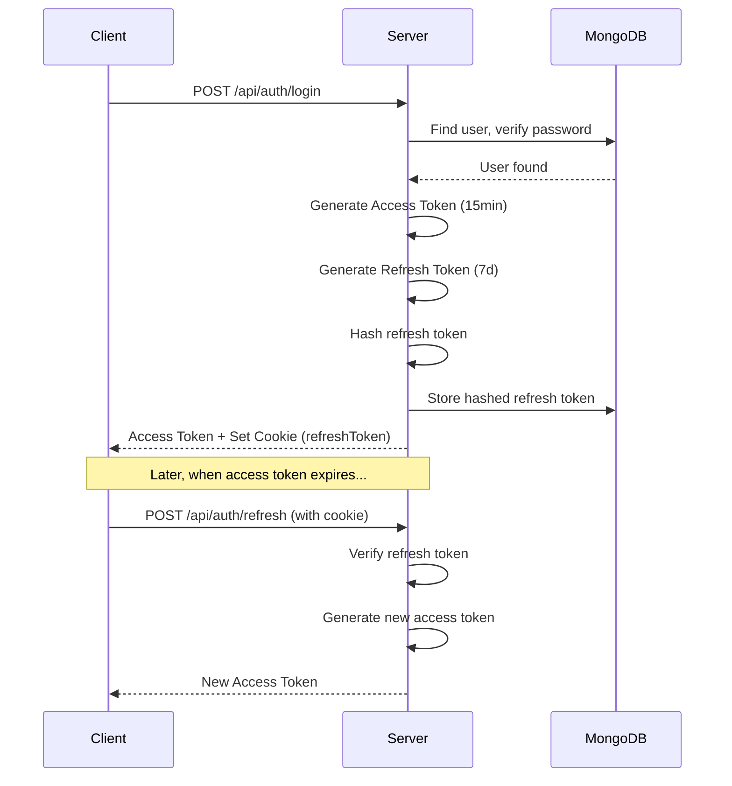

# Solvify Backend Documentation

> Comprehensive documentation for the Node.js/Express backend API

---

## 1. Overview

Solvify's backend is a **Node.js/Express** application that provides RESTful API services for user authentication, inquiry management, and quotation handling. The architecture follows a modular, layered design with clear separation of concerns.

### Key Technologies

| Technology | Purpose |
|------------|---------|
| **Express 5** | Web framework for API routing and middleware |
| **MongoDB + Mongoose** | Database and ODM for data persistence |
| **JWT (jsonwebtoken)** | Access and refresh token authentication |
| **Argon2** | Password hashing |
| **Passport.js** | Google OAuth authentication |
| **Inngest** | Background job processing for emails |
| **Nodemailer + Mailtrap** | Email delivery |
| **Helmet** | Security headers |
| **CORS** | Cross-origin resource sharing |

---

## 2. Project Structure

```
server/
├── src/
│   ├── app.js              # Express app configuration & middleware setup
│   ├── server.js           # HTTP server bootstrap & graceful shutdown
│   ├── config/
│   │   └── env.js          # Environment variable validation & export
│   ├── controllers/
│   │   ├── auth.controller.js     # Authentication logic
│   │   └── inquiry.controller.js  # Inquiry creation logic
│   ├── db/
│   │   └── mongo.js        # MongoDB connection with retry logic
│   ├── inngest/
│   │   ├── index.js        # Inngest client initialization
│   │   └── functions/      # Background job handlers
│   │       ├── helloWorld.js
│   │       ├── on-signup.js
│   │       ├── on-forgot-password.js
│   │       ├── on-password-change.js
│   │       └── on-inquiry-submission.js
│   ├── middlewares/
│   │   ├── deserializeuser.js  # JWT token verification
│   │   ├── requireAuth.js      # Protected route guard
│   │   ├── errorHandler.js     # Global error handling
│   │   └── validate.js         # Request validation
│   ├── models/
│   │   ├── user.model.js       # User schema with password hashing
│   │   ├── inquiry.model.js    # Inquiry schema with auto-ID generation
│   │   ├── quotation.model.js  # Quotation schema
│   │   ├── services.model.js   # Service catalog schema
│   │   └── counter.model.js    # Auto-increment counter
│   ├── routes/
│   │   ├── index.js        # Main router aggregator
│   │   ├── auth.routes.js  # Authentication endpoints
│   │   └── user.routes.js  # User-related endpoints
│   ├── services/
│   │   ├── auth.service.js     # Token generation & verification
│   │   ├── passport.js         # Google OAuth strategy
│   │   └── email.service.js    # Email service utilities
│   └── utils/
│       ├── crypto.js       # Hashing utilities (Argon2, SHA-256)
│       ├── mailer.js       # Nodemailer/Mailtrap configuration
│       ├── googleClient.js # Google OAuth client
│       └── mails/          # Email templates
├── package.json
├── .env.example
└── .gitignore
```

### Directory Purposes

| Directory | Purpose |
|-----------|---------|
| `config/` | Environment configuration and validation |
| `controllers/` | Request handlers containing business logic |
| `db/` | Database connection and management |
| `inngest/` | Background job definitions for async tasks |
| `middlewares/` | Express middleware for auth, validation, errors |
| `models/` | Mongoose schemas and model definitions |
| `routes/` | API endpoint definitions and routing |
| `services/` | Reusable business logic and external service integrations |
| `utils/` | Helper functions, constants, and utilities |

---

## 3. API Endpoints

### Base URL
```
http://localhost:{PORT}/api
```

---

### Authentication Routes (`/api/auth`)

#### Register User
```http
POST /api/auth/register
```

**Request Body:**
```json
{
  "name": "John Doe",
  "email": "john@example.com",
  "phone": "1234567890",
  "company": "Acme Inc",
  "password": "SecurePass123"
}
```

**Success Response (201):**
```json
{
  "message": "User registered successfully",
  "user": {
    "id": "64abc123...",
    "name": "John Doe",
    "email": "john@example.com"
  }
}
```

**Error Response (400):**
```json
{
  "message": "User already exists"
}
```

---

#### Login User
```http
POST /api/auth/login
```

**Request Body:**
```json
{
  "name": "john@example.com",
  "password": "SecurePass123"
}
```

> **Note:** The `name` field accepts either username or email for flexible login.

**Success Response (200):**
```json
{
  "message": "Login successful",
  "accessToken": "eyJhbGciOiJIUzI1NiIsInR5cCI6...",
  "user": {
    "id": "64abc123...",
    "name": "John Doe",
    "email": "john@example.com"
  }
}
```

**Cookies Set:**
- `refreshToken` (HttpOnly, Secure, SameSite=None, 7 days)

---

#### Logout User
```http
POST /api/auth/logout
```

**Success Response (200):**
```json
{
  "message": "Logout Successful"
}
```

---

#### Refresh Token
```http
POST /api/auth/refresh
```

**Cookies Required:**
- `refreshToken` (sent automatically via HttpOnly cookie)

**Success Response (200):**
```json
{
  "newAccessToken": "eyJhbGciOiJIUzI1NiIsInR5cCI6...",
  "message": "New access token issued",
  "user": { ... }
}
```

---

#### Forgot Password
```http
POST /api/auth/forgot-password
```

**Request Body:**
```json
{
  "email": "john@example.com"
}
```

**Success Response (200):**
```json
{
  "message": "If an account exists, a reset link has been sent to your email."
}
```

> **Security:** Response is the same whether the email exists or not to prevent enumeration attacks.

---

#### Validate Reset Token
```http
GET /api/auth/validate-reset-token/:token
```

**Success Response (200):**
```json
{
  "valid": true,
  "message": "Token is valid",
  "email": "john@example.com"
}
```

**Error Response (400):**
```json
{
  "valid": false,
  "message": "Invalid or expired reset url"
}
```

---

#### Reset Password
```http
POST /api/auth/reset-password/:token
```

**Request Body:**
```json
{
  "email": "john@example.com",
  "newPassword": "NewSecurePass456"
}
```

**Success Response (200):**
```json
{
  "message": "Password reset successful. You can now login with your new password."
}
```

---

#### Google OAuth Login
```http
GET /api/auth/google?code={authorization_code}
```

**Query Parameters:**
- `code`: OAuth authorization code from Google

**Success Response (200):**
```json
{
  "message": "success",
  "accessToken": "eyJhbGciOiJIUzI1NiIsInR5cCI6...",
  "userInfo": {
    "_id": "64abc123...",
    "name": "John Doe",
    "email": "john@example.com",
    "image": "https://lh3.googleusercontent.com/..."
  }
}
```

---

### User Routes (`/api/user`)

#### Create Inquiry
```http
POST /api/user/inquiry
```

**Request Body:**
```json
{
  "name": "John Doe",
  "email": "john@example.com",
  "phone": "+1234567890",
  "company": "Acme Inc",
  "service": "web development",
  "projectTitle": "E-commerce Platform",
  "description": "Build a full-featured e-commerce website...",
  "budget": "$10,000 - $25,000",
  "timeline": "3 months"
}
```

**Success Response (201):**
```json
{
  "message": "Inquiry created successfully",
  "inquiry": {
    "_id": "64abc123...",
    "inquiryId": "INQ-2025-0001",
    "name": "John Doe",
    "email": "john@example.com",
    "status": "pending",
    ...
  }
}
```

---

### Utility Routes

#### Health Check
```http
GET /health
```

**Response (200):**
```json
{
  "status": "ok",
  "message": "API is healthy"
}
```

#### API Root
```http
GET /api
```

**Response (200):**
```json
{
  "message": "Welcome to the API 🚀"
}
```

---

## 4. Database Schema

### User Model

```javascript
{
  name: String,           // Required, trimmed
  email: String,          // Required, unique, lowercase
  phone: String,          // Default: ''
  company: String,        // Default: ''
  password: String,       // Hashed with Argon2 (pre-save hook)
  role: 'client' | 'admin',  // Default: 'client'
  image: String,          // Profile picture URL
  isActive: Boolean,      // Default: true
  refreshTokens: [String], // Array of hashed refresh tokens
  resetPasswordToken: String,
  resetPasswordExpiresAt: Date,
  createdAt: Date,
  updatedAt: Date
}
```

### Inquiry Model

```javascript
{
  inquiryId: String,      // Auto-generated: INQ-YYYY-XXXX
  userId: ObjectId,       // Reference to User (optional for guests)
  name: String,           // Required
  email: String,          // Required, validated
  phone: String,          // Required
  company: String,        // Default: ''
  service: String,        // Required (e.g., 'web development')
  projectTitle: String,   // Required
  description: String,    // Required
  budget: String,         // Required
  timeline: String,       // Required
  attachment: {
    filename: String,
    filepath: String,
    filesize: Number
  },
  referralSource: String,
  additionalComments: String,
  status: 'pending' | 'under_review' | 'quotation_sent' | 'in_progress' | 'completed' | 'rejected',
  adminNotes: String,
  quotationId: ObjectId,  // Reference to Quotation
  createdAt: Date,
  updatedAt: Date
}
```

### Quotation Model

```javascript
{
  quotationId: String,    // Auto-generated: QUO-YYYY-XXXX
  inquiryId: ObjectId,    // Reference to Inquiry (required)
  clientName: String,
  clientEmail: String,
  projectName: String,
  lineItems: [{
    description: String,
    quantity: Number,
    unitPrice: Number,
    subtotal: Number
  }],
  subtotal: Number,
  taxPercentage: Number,
  taxAmount: Number,
  discount: Number,
  totalAmount: Number,
  paymentTerms: String,
  timeline: String,
  termsAndConditions: String,
  pdfUrl: String,
  status: 'draft' | 'sent' | 'accepted' | 'rejected',
  sentAt: Date,
  respondedAt: Date,
  createdAt: Date,
  updatedAt: Date
}
```

### Service Model

```javascript
{
  serviceName: String,    // Required, unique
  category: 'web' | 'mobile' | 'data' | 'ai_integration' | 'ai_automation' | 'other',
  shortDescription: String,  // Max 200 characters
  detailedDescription: String,  // HTML/Markdown
  icon: String,              // URL
  technologies: [String],
  startingPrice: Number,
  features: [String],
  isActive: Boolean,
  order: Number,             // Display order
  createdAt: Date,
  updatedAt: Date
}
```

### Counter Model

```javascript
{
  id: String,     // e.g., 'inquiry_2025'
  seq: Number     // Auto-incrementing sequence
}
```

> **Note:** The Counter model is used internally to generate sequential IDs (INQ-YYYY-XXXX, QUO-YYYY-XXXX).

---

## 5. Authentication & Authorization

### Authentication Flow



### JWT Token Structure

**Access Token:**
- **Expires:** 15 minutes
- **Payload:** `{ id: userId }`
- **Secret:** `ACCESS_TOKEN_SECRET`

**Refresh Token:**
- **Expires:** 7 days
- **Payload:** `{ id: userId }`
- **Secret:** `REFRESH_TOKEN_SECRET`
- **Storage:** HttpOnly cookie + hashed in database

### Protected Routes

Routes requiring authentication should use the following middleware chain:

```javascript
// 1. deserializeUser - Extracts and verifies JWT from Authorization header
// 2. requireAuth - Ensures req.user exists

import { deserializeUser } from "../middlewares/deserializeuser.js";
import { requireAuth } from "../middlewares/requireAuth.js";

router.get("/protected", deserializeUser, requireAuth, handler);
```

### Authorization Header Format

```
Authorization: Bearer <access_token>
```

---

## 6. Middleware

| Middleware | File | Purpose |
|------------|------|---------|
| `helmet()` | Built-in | Security headers (XSS, clickjacking protection) |
| `cors()` | Built-in | Cross-origin request handling |
| `cookieParser()` | Built-in | Parse cookies from request |
| `express.json()` | Built-in | Parse JSON request bodies |
| `morgan("dev")` | Built-in | HTTP request logging |
| `passport` | Built-in | OAuth authentication strategies |
| `deserializeUser` | `deserializeuser.js` | Verify JWT and attach user to request |
| `requireAuth` | `requireAuth.js` | Block unauthenticated requests |

### deserializeUser Middleware

```javascript
// Workflow:
// 1. Check for Authorization header with Bearer token
// 2. Extract and verify JWT using ACCESS_TOKEN_SECRET
// 3. Fetch user from database
// 4. Attach user to req.user
// 5. If no token, allow request to continue (for public routes)
```

### requireAuth Middleware

```javascript
// Simple guard that returns 401 if req.user is not set
export const requireAuth = (req, res, next) => {
    if (!req.user) {
        return res.status(401).json({ message: "Unauthorized" })
    }
    next();
};
```

---

## 7. Error Handling

### Global Error Handler

Located in `app.js`:

```javascript
app.use((err, req, res, next) => {
  console.error("Error handler:", err);
  res.status(err.status || 500).json({
    success: false,
    message: err.message || "Internal Server Error"
  });
});
```

### Standard Error Response Format

```json
{
  "success": false,
  "message": "Error description"
}
```

### Common HTTP Status Codes

| Code | Meaning | Usage |
|------|---------|-------|
| 200 | OK | Successful GET, PUT |
| 201 | Created | Successful POST (resource created) |
| 400 | Bad Request | Validation errors, duplicate email |
| 401 | Unauthorized | Missing or invalid token |
| 403 | Forbidden | Token refresh missing |
| 404 | Not Found | Resource doesn't exist |
| 500 | Server Error | Unexpected errors |

---

## 8. Environment Variables

Create a `.env` file based on `.env.example`:

| Variable | Description | Required |
|----------|-------------|----------|
| `PORT` | Server port (default: 4000) | No |
| `MONGO_URI` | MongoDB connection string | Yes |
| `ACCESS_TOKEN_SECRET` | JWT access token secret key | Yes |
| `REFRESH_TOKEN_SECRET` | JWT refresh token secret key | Yes |
| `CORS_ORIGIN` | Allowed CORS origins | Yes |
| `FRONTEND_URL` | Frontend app URL (for reset links) | Yes |
| `EMAIL_FROM` | Sender email address | Yes |
| `SMTP_HOST` | SMTP server host | Yes |
| `SMTP_PORT` | SMTP server port | Yes |
| `SMTP_USER` | SMTP username | Yes |
| `SMTP_PASS` | SMTP password / Mailtrap API token | Yes |
| `GOOGLE_CLIENT_ID` | Google OAuth client ID | Yes |
| `GOOGLE_CLIENT_SECRET` | Google OAuth client secret | Yes |
| `REDIRECT_URL` | Google OAuth redirect URL | Yes |
| `NODE_ENV` | Environment (`development` / `production`) | No |
| `INNGEST_EVENT_KEY` | Inngest event key | Yes |
| `INNGEST_SIGNING_KEY` | Inngest signing key | Yes |
| `COOKIE_KEY` | Cookie session encryption key | Yes |

---

## 9. External Services

### Mailtrap (Email Service)

Used for transactional email delivery.

**Configuration:** `src/utils/mailer.js`

```javascript
import nodemailer from "nodemailer";
import { MailtrapTransport } from "mailtrap";

const transporter = nodemailer.createTransport(
  MailtrapTransport({ token: process.env.SMTP_PASS })
);
```

**Email Categories:**
- Welcome emails (on signup)
- Forgot password emails
- Password change confirmations
- Inquiry submission notifications

### Inngest (Background Jobs)

Event-driven background job processor for async tasks.

**Events Handled:**

| Event Name | Trigger | Action |
|------------|---------|--------|
| `user/signup` | User registration | Send welcome email |
| `user/forgot-password` | Forgot password request | Send reset link email |
| `user/password-change` | Password reset complete | Send confirmation email |
| `inquiry/submit` | New inquiry created | Process inquiry, notify admin |

**Configuration:** `src/inngest/index.js`

**Inngest Dev Server:**
```bash
npm run inngest-dev
```

### Google OAuth

Used for social login functionality.

**Configuration:** `src/utils/googleClient.js` and `src/services/passport.js`

---

## 10. Development & Deployment

### Prerequisites

- Node.js 18+
- MongoDB (local or Atlas)
- npm or yarn

### Installation

```bash
# Clone repository
git clone <repository-url>
cd server

# Install dependencies
npm install

# Configure environment
cp .env.example .env
# Edit .env with your configuration
```

### NPM Scripts

| Script | Command | Description |
|--------|---------|-------------|
| `start` | `npx nodemon src/server.js` | Start dev server with hot reload |
| `inngest-dev` | `npx inngest-cli@latest dev -u http://localhost:3000/api/inngest` | Start Inngest dev server |

### Running the Application

```bash
# Terminal 1: Start the server
npm start

# Terminal 2: Start Inngest dev server (for background jobs)
npm run inngest-dev
```

### MongoDB Connection

The application uses exponential backoff retry logic for MongoDB connections:
- **Max Retries:** 5
- **Initial Delay:** 500ms
- **Pool Size:** 10 connections

### Server Startup Sequence

1. Load environment variables
2. Connect to MongoDB (with retries)
3. Start HTTP server on configured port
4. Register graceful shutdown handlers (SIGINT, SIGTERM)

### Graceful Shutdown

The server handles shutdown signals gracefully:
- Closes HTTP server
- Allows existing requests to complete
- Exits process cleanly

### Deployment Checklist

- [ ] Set `NODE_ENV=production`
- [ ] Configure production MongoDB URI
- [ ] Set strong, unique JWT secrets
- [ ] Configure CORS for production domain
- [ ] Set up Mailtrap production credentials
- [ ] Configure Inngest production keys
- [ ] Enable `secure: true` for cookies (HTTPS)
- [ ] Set up process manager (PM2, etc.)

### CORS Configuration

Currently configured for:
- `http://localhost:5173` (local development)
- `https://solvify-topaz.vercel.app` (production)
- `https://solvify-kumarprakharkp143-3045s-projects.vercel.app` (preview)

---

## Quick Reference

### API Endpoints Summary

| Method | Endpoint | Auth Required | Description |
|--------|----------|---------------|-------------|
| GET | `/health` | No | Health check |
| GET | `/api` | No | API welcome |
| POST | `/api/auth/register` | No | Register user |
| POST | `/api/auth/login` | No | Login user |
| POST | `/api/auth/logout` | No | Logout user |
| POST | `/api/auth/refresh` | Cookie | Refresh token |
| POST | `/api/auth/forgot-password` | No | Request reset |
| GET | `/api/auth/validate-reset-token/:token` | No | Validate reset token |
| POST | `/api/auth/reset-password/:token` | No | Reset password |
| GET | `/api/auth/google` | No | Google OAuth |
| POST | `/api/user/inquiry` | No | Create inquiry |

---

*Last updated: December 2025*
